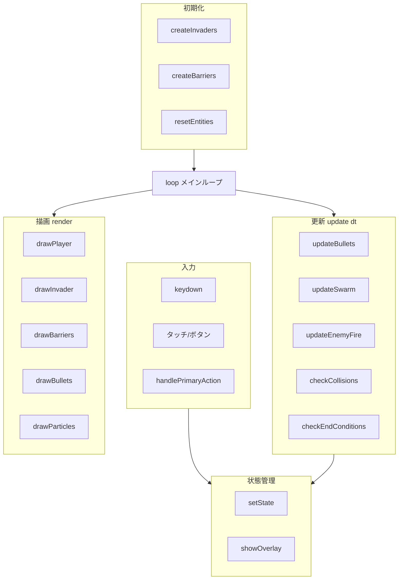
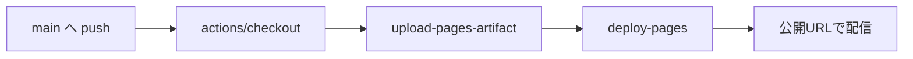

# アーキテクチャドキュメント

インベーダーゲームの内部構成・設計方針をまとめたドキュメントです。

## 技術スタック

| 項目 | 採用技術 | 理由 |
| --- | --- | --- |
| 描画 | HTML5 Canvas 2D | ピクセルアートと多数のスプライト描画に最適 |
| 言語 | Vanilla JavaScript (ES2015+) | ビルド不要・GitHub Pages でそのまま動作 |
| 状態保存 | `localStorage` | ハイスコアの永続化 |
| デプロイ | GitHub Actions → GitHub Pages | push のみで自動公開 |

依存ライブラリ・ビルドツールは **一切不要** です。

## モジュール構成（`game.js`）

`game.js` は IIFE（即時実行関数）で全体をカプセル化し、グローバル汚染を防いでいます。
論理的には以下のセクションに分かれています。



## ゲームループ

固定の `requestAnimationFrame` ベースで、フレーム間の経過時間 `dt`（秒）を用いた
**デルタタイム駆動** にしています。これにより端末のリフレッシュレートに依存せず
一定速度で動作します（`dt` は最大 0.05 秒にクランプしてスパイクを防止）。

```
loop(timestamp)
  ├─ dt = (timestamp - lastTime) / 1000   // 最大0.05にクランプ
  ├─ update(dt)                            // 状態に応じた更新
  └─ render()                              // 全エンティティ描画
```

## 主要なエンティティ

| エンティティ | データ構造 | 説明 |
| --- | --- | --- |
| `player` | オブジェクト | 砲台。位置・速度・発射クールダウン |
| `invaders[]` | 配列 | インベーダー群。`alive` `points` `frame` を持つ |
| `playerBullets[]` / `enemyBullets[]` | 配列 | 自弾・敵弾 |
| `barriers[]` | 配列 | 破壊可能なバリアのセル（`hp` 付き） |
| `particles[]` | 配列 | 爆発エフェクト |

## ゲームデザインの工夫

- **群れの加速**: インベーダーの残数が減るほど水平速度を上げ、終盤の緊張感を演出。
- **最前線のみ発射**: 各列の最下段の敵だけが弾を撃つ古典的ルールを再現。
- **破壊可能バリア**: バリアを 7×5 のセルに分割し、被弾ごとに `hp` を減らして劣化を表現。
- **レベルスケーリング**: レベルに応じて行数（最大6）・速度・発射頻度を上昇。
- **当たり判定**: 軸並行矩形 (AABB) 判定 `rectsOverlap()` でシンプルかつ高速。

## レスポンシブ / モバイル対応

- Canvas は CSS で幅 100%（最大 480px）にスケーリングし、内部解像度は固定（480×600）。
- `@media (hover: none) and (pointer: coarse)` でタッチ操作ボタンを表示。
- タッチイベントは `preventDefault` でスクロール・ズームを抑制。

## デプロイ

GitHub Actions ワークフロー `.github/workflows/deploy.yml` がリポジトリ全体を
GitHub Pages のアーティファクトとして公開します。

### 初期設定（初回のみ）

1. GitHub リポジトリの **Settings → Pages** を開く
2. **Build and deployment → Source** を **「GitHub Actions」** に変更
3. `main` ブランチに push するとワークフローが走り、自動公開される

公開 URL: `https://<ユーザー名>.github.io/invader_game/`

### ワークフローの流れ


