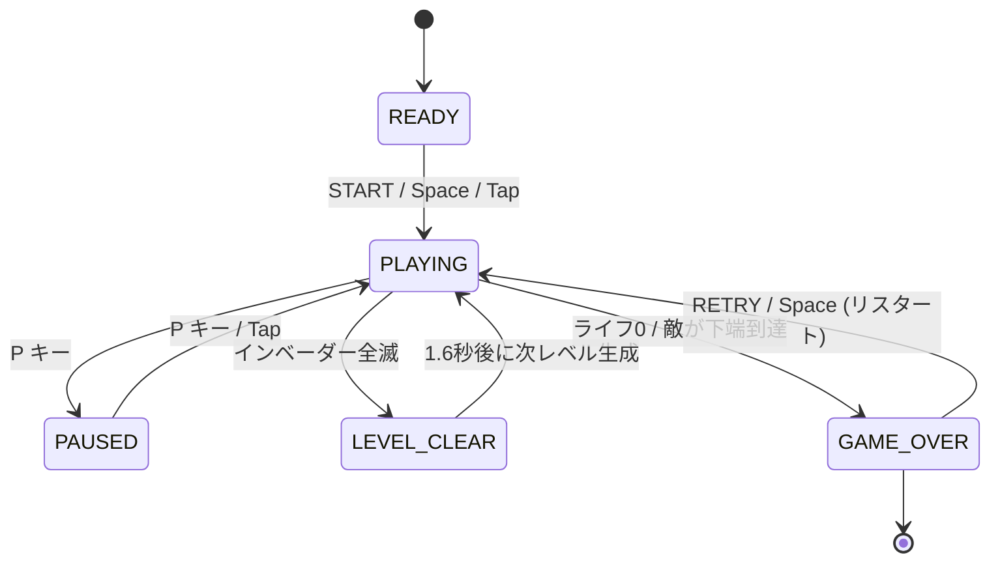
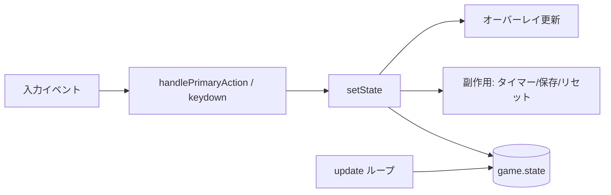
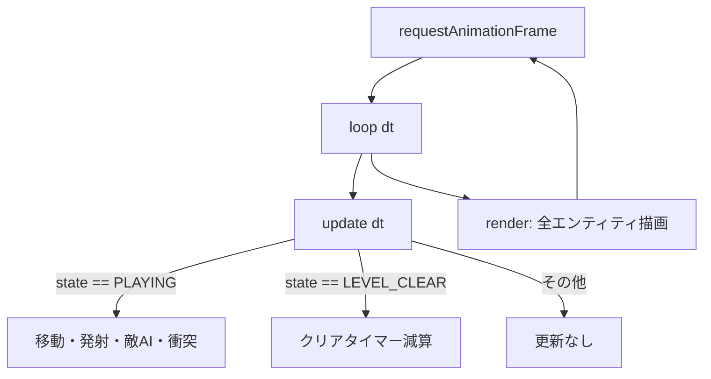

# ゲーム状態遷移グラフ (State Graph)

このゲームは **有限ステートマシン (FSM)** として設計されています。
LangGraph のようなグラフ指向の考え方で、各「状態 (ノード)」と「遷移 (エッジ)」を
明示的に定義することで、ゲームフローの見通しを良くしています。

状態は `game.js` 内の `State` オブジェクトに対応します。

```js
const State = {
  READY,        // 開始待ち
  PLAYING,      // プレイ中
  PAUSED,       // 一時停止
  LEVEL_CLEAR,  // レベルクリア演出
  GAME_OVER,    // ゲームオーバー
};
```

## 状態遷移図 (Mermaid)



## 状態ごとの責務

| 状態 | 説明 | 主な更新処理 | 遷移先 |
| --- | --- | --- | --- |
| `READY` | タイトル表示・開始待ち | なし（描画のみ） | `PLAYING` |
| `PLAYING` | コアゲームループ | 移動・発射・敵AI・当たり判定 | `PAUSED` / `LEVEL_CLEAR` / `GAME_OVER` |
| `PAUSED` | 一時停止 | なし | `PLAYING` |
| `LEVEL_CLEAR` | クリア演出（タイマー） | パーティクルのみ更新 | `PLAYING`（次レベル） |
| `GAME_OVER` | 終了・ハイスコア保存 | なし | `PLAYING`（リスタート） |

## 遷移を司る関数

すべての状態遷移は `setState(next)` を通して行われます。
これにより副作用（オーバーレイ表示・ハイスコア保存・タイマー初期化）を一元管理しています。



## ゲームループとの関係

`requestAnimationFrame` による `loop()` は毎フレーム `update(dt)` を呼び、
`game.state` の値に応じて処理を分岐します。


